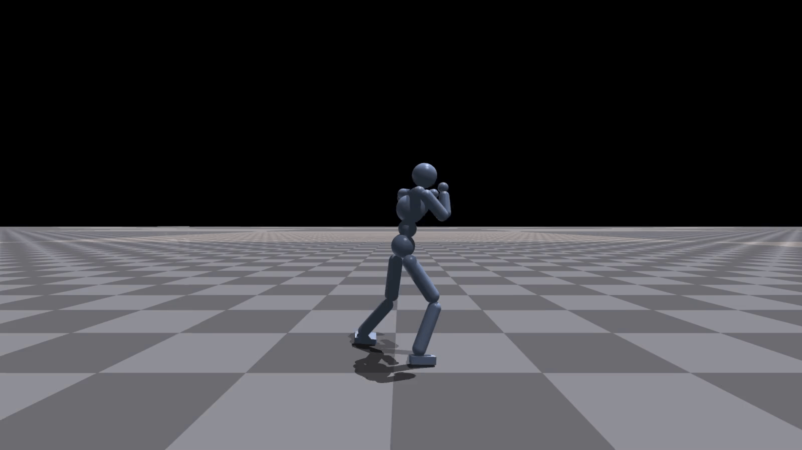
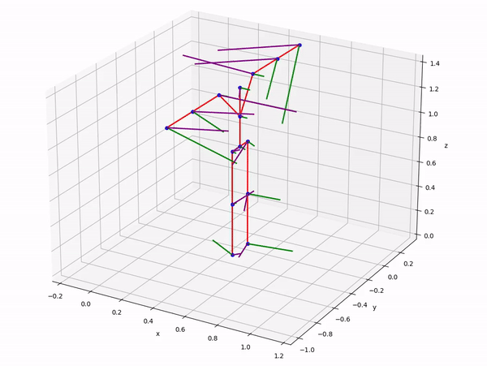

# Noise-conditioned Energy-based Annealed Rewards (NEAR) - A Generative Framework for Imitation Learning from Observation

<p align="center">
   
   
   
</p>

<p align="center">
  <em>Punching (left), running (middle), and martial arts crane pose (right) policies learnt using NEAR</em>
</p>


## About this repository

This repository contains the implementation of NEAR, a state-only imitation learning algorithm based on score/energy-based generative modelling. The base version of this repository was forked from [Nvidia IsaacGym Environments](https://github.com/NVIDIA-Omniverse/IsaacGymEnvs). This fork contains the newly proposed algorithm, experiments, and reporoduction information. We also provide additional information like documentation on parts of the code and the datasets used in this research.

<br><br>


## Installation

**NOTE: This repository requires Ubuntu 20.04 and Python 3.7. These are hard requirements and are the latest possible Ubuntu/Python versions that are supported by Nvidia Isaac Gym**

This installation proceeds in three main steps. First, we install Isaac Gym, then we install the `isaacgymenvs` package (this repo). Finally we install the remaining packages required to train the proposed score/energy-based imitation learning algorithm.

1. Download the Isaac Gym Preview 4 release from the [website](https://developer.nvidia.com/isaac-gym), then follow the installation instructions in the documentation. The conda environment installation option is required to run the code base from this project (other options might work but are not tested).

2. Ensure that Isaac Gym works on your system by running one of the examples from the `python/examples` directory, like `joint_monkey.py`. Follow the troubleshooting steps described in the Isaac Gym Preview 4 install instructions if you have any trouble running the samples. For instance, you might need to add the environment variable `LD_LIB_PATH`. 

3. Once Isaac Gym is installed and samples work within your current Python environment, install this repo:

```bash
conda install -c anaconda git
git clone --recurse-submodules -b <branch> https://github.com/anishhdiwan/near.git
cd <dir-name>
pip install -e .
```

4. Finally, install the remaining dependencies:

```bash
pip install -r requirements.txt
```

5. If you plan to modify or visualise the Humanoid environment training data, you will also need to install the Autodesk .fbx Python SDK. Follow the instructions [here](https://help.autodesk.com/view/FBX/2020/ENU/?guid=FBX_Developer_Help_scripting_with_python_fbx_installing_python_fbx_html) to download the Python SDK. Once, installed, the Python package and libraries then need to be copied over to the conda environment to be accessible by other Python programs. Follow the instructions [here](https://download.autodesk.com/us/fbx/20112/fbx_sdk_help/index.html?url=WS73099cc142f48755-751de9951262947c01c-6dc7.htm,topicNumber=d0e8430) to do so. The whole procedure is also transcribed below. Note that you need to install the Python SDK and NOT the standard FBX SDK. The latest version that was tested with this repository is version 2020.2.1 for Python 3.7.

  - Download the Python SDK from [here](https://aps.autodesk.com/developer/overview/fbx-sdk)
  - Once downloaded, extract the archive and follow the instructions in the installation instructions file (it is recommended to make a new folder for the SDK to avoid clutter)
  - Once installed, navigate to the `lib` directory in the installation folder. Copy the contents of `<yourFBXSDKpath>\lib\<Pythonxxxxxx>\` to `conda\envs\rlgpu\lib\python3.7\site-packages\.`
  - NOTE: for the sdk to work, you need to add the LD_LIB_PATH environment variable `export LD_LIB_PATH=<conda path>/envs/rlgpu/lib`

<br><br>


## Training 

> [Hyperparams are explained here](./docs/hyperparameters.md)

**Training is a two-step procedure. First we train the energy-based model and subsequently use the trained model to learn a policy.**

**Note:** 
- Set params in the `near_cfg` part of the `train/<task-name>NEARPPO.yml` file. The main params that need to be set are also mentioned below.
- The task data for CPU environments (mazeNEAR, pushTNEAR) is loaded automatically. The task data for the Humanoid environment is passed in the `motion_file` param of the `task/HumanoidNEAR.yaml` file. This data is either in the `custom_envs/data/humanoid` directory or in the `assets` directory. Passing a .yaml file loads several motions while passing a single .npy file does single-clip training.
- Before training the policy, add the path to the trained energy-based model checkpoint in the `near_cfg` part of the `train/<task-name>NEAR.yml` file.
- With IsaacGym, by default we show a preview window, which will usually slow down training. You can use the `v` key while running to disable viewer updates and allow training to proceed faster. Hit the `v` key again to resume viewing. Use the `esc` key or close the viewer window to stop training early. Alternatively, you can train headlessly by adding the headless:True argument. 

### Step 1: Training the energy-based reward function
```bash
# tasks = [mazeNEAR, pushTNEAR, HumanoidNEAR]
python train_ncsn.py task=<task-name>

# The following additional params can be set to override defaults
# ++task.env.motion_file= seed=
# ++train.params.config.near_config.model.ncsnv2={bool; ncsnv2} 

```

### Step 2: Training the RL policy

```bash
# For CPU-based environments
# tasks = [mazeNEAR, pushTNEAR]
python train_gym_envs.py task=<task-name> headless=<bool>  
```

```bash
# For Isaac Gym environments
# tasks = [HumanoidNEAR]
python train.py task=<task-name> headless=<bool>  
```

```bash
# The following additional params can be set to override defaults
# ++task.env.motion_file= seed=
# max_iterations=ke6 num_envs= ++train.params.config.minibatch_size=
# ++train.params.config.near_config.inference.sigma_level={-1 if annealing} 
# ++train.params.config.near_config.model.ncsnv2={bool; ncsnv2} 
# ++train.params.config.near_config.inference.task_reward_w={w_task} 
# ++train.params.config.near_config.inference.energy_reward_w={w_style} 
# ++train.params.config.near_config.inference.eb_model_checkpoint={eb_model_checkpoint}"
# ++train.params.config.near_config.inference.running_mean_std_checkpoint={running_mean_std_checkpoint}
```

### Goal-Conditioned RL & Spatial Composition

The learnt rewards can also be composed with global task objectives or another learnt style reward. For example, when the learnt energy reward for the walking motion is combined with a task reward for reaching a randomly placed target, the agent can now walk towards the target. To achieve this, the RL problem is modified to be a goal conditioned RL problem and a goal state is concatenated with the agent's state. Additionally, we also offer an option to concatenate multiple learnt energy rewards to obtain spatially composed motions like walking while doing hand gestures. Both these options are inferred from the config. 

**Goal Conditioning**
```bash
# For goal-conditioned RL there are currently two options [target reaching, and punching a box]. These can be specifed with the following optional params (task rewards are automatically added and can be weighted using near_config.inference.task_reward)
++task.env.envAssets=["flagpole"] # for target reaching or 
++task.env.envAssets=["box"] # for target reaching + punching
```

**Energy Reward Composition**
```bash
# For composed learnt rewards there is no additional config option. Instead, composition is enabled if the energy based model is passed as a dictionary. In this case, the standardisation checkpoints must be passed as a list.
++train.params.config.near_config.inference.eb_model_checkpoint="{"amp_humanoid_walk.yaml":"ncsn_runs/HumanoidNEAR_walk/nn/checkpoint.pth", "amp_humanoid_crane_pose.yaml":"ncsn_runs/HumanoidNEAR_crane_pose/nn/checkpoint.pth"}"

++train.params.config.near_config.inference.running_mean_std_checkpoint="{"amp_humanoid_walk.yaml":"ncsn_runs/HumanoidNEAR_walk/nn/running_mean_std.pth", "amp_humanoid_crane_pose.yaml":"ncsn_runs/HumanoidNEAR_crane_pose/nn/running_mean_std.pth"}"

# If the punching task is enabled with energy reward composition, then the first energy reward is assumed to be for locomotion and the second one for punching. In this case, the punching reward is only enabled when the agent is within some minimum distance to the target. In all other cases, the rewards are combined with a 3:1 ratio. 
```
**Optional Config Settings**
```bash
++task.env.localRootObs=True # To ignore the agent's heading in the state computation (necessary for target reaching)
++train.params.config.near_config.inference.composed_feature_mask="["lower_body", "upper_body"]" # To apply a mask on the energy network's features, for example, to only use lower body features for walking and upper body features for hand motions

# In case a mask is used, the energy network must also be trained with the same mask. This means that the following option is passed when training the energy function. And near_config.inference.composed_feature_mask is passed when using the trained energy function as a reward. 
++train.params.config.near_config.model.feature_mask="upper_body". 
```

<br><br>


## Training baselines 

**Baselines such as Adversarial Motion Priors and Cross Entropy Method (currently only for CPU envs) are trained similarly to the previous procedure. However, they do not need the first step of training the energy based model. Training can be done as follows.**


```bash
# For CPU-based environments
# tasks = [mazeAMP, mazeCEM, pushTAMP, pushTCEM, pushT, maze]
# If no algo is mentioned, then PPO is used by default (example: pushT trains with PPO while pusTAMP trains with AMP)
# For CEM, also mention the train script separately (example: python train_gym_envs.py task=mazeCEM train=mazeCEM)
python train_gym_envs.py task=<task-name> headless=<bool>  
```

```bash
# For Isaac Gym environments
# tasks = [HumanoidAMP, Humanoid]
# If no algo is mentioned, then PPO is used by default (example: Humanoid trains with PPO while HumanoidAMP trains with AMP)
python train.py task=<task-name> headless=<bool>  
```

<br><br>


## Visualising trained policies

Trained policies can be visualised as follows. Make sure to set the visualise_disc and visualise_disc_landscape arguments of in `tasks/mazeAMPPPO.yaml` and `tasks/HumanoidAMPPPO.yaml` to False.

```bash
# For CPU-based environments
# tasks = [mazeAMP, pushTAMP, pushT, maze, mazeNEAR, pushTNEAR]
python train_gym_envs.py task=<task-name> test=True checkpoint=<path-to-saved-checkpoint>
```

```bash
# For Isaac Gym environments
# tasks = [HumanoidAMP, Humanoid, HumanoidNEAR]
python train.py task=<task-name> test=True checkpoint=<path-to-saved-checkpoint> 
```


### Visualising the energy function or AMP discriminator
The energy-function or the adversarial motion priors discriminator can be visualised with the following commands.

```bash
# Visualising the energy function
python train_ncsn.py task=mazeNEAR test=True
```

```bash
# Visualising the discriminator
# Make sure to set the visualise_disc argument of in tasks/mazeAMPPPO.yaml to True
python train_gym_envs.py task=mazeAMP test=True checkpoint=<path-to-saved-checkpoint>
```

<br><br>

## Datasets
**NOTE: The data used in this project is a modified version of a dataset obtained from [http://mocap.cs.cmu.edu/](http://mocap.cs.cmu.edu/). This database was created with funding from NSF EIA-0196217**

> [Modified dataset can be found here](https://doi.org/10.4121/0448aab2-3332-449f-a8e2-d208cb58c7df)
<p align="center">
   </br>
  <em>Example of an expert demonstration trajectory (humanoid walking)</em>
</p>


This repository contains processed expert demonstration data (reformatted, retargeted, and grouped as per tasks) for training both AMP and the proposed approach. Hence, no additional data procurement/manipulation is needed to train the methods in this repository. The processed expert motions are placed in the `isaacgymenvs/custom_envs/data/humanoid` directory and a .yaml file is created to pass them all together to the learning algorithm. The following section describes these data processing steps and provides a general guide to using the pipelines in this repository to manipulate the [CMU mo-cap dataset (.fbx version)](https://doi.org/10.4121/0448aab2-3332-449f-a8e2-d208cb58c7df)


### Viewing, reformatting, and retargeting motion data

The Adversarial Motion Priors codebase provides useful tools to process .fbx format conversions of the CMU mo-cap dataset. This repository extends these tools. To process your own demonstration data first obtain the dataset in the .fbx format ([available here](https://doi.org/10.4121/0448aab2-3332-449f-a8e2-d208cb58c7df)). The dataset contains a directory housing all .fbx format motion files (numbered xx_yy where the first part indicates the subject number and the second part indicates the motion number). It also contains a .txt file describing all motions and a .csv file where some of the motions are grouped as per the "task" seen in the clip. Finally, the dataset also contains a .txt file with a list of the identified tasks (not exhaustive). These tasks are ultimately used to process groups of motions together to create sub-datasets.
 

1. The `isaacgymenvs/tasks/amp/poselib` directory houses some scripts for data processing. Use the `fbx_motion_to_npy.py` script to convert the .fbx dataset into .npy files or to simply view motions in the dataset. Motions can be viewed with their motion label in the dataset or the task category. Use the --help option to list all possible options.

```bash
# Viewing individual motions
python fbx_motion_to_npy.py --motion=49_06

# Preview motions categorised as tasks
python fbx_motion_to_npy.py --no_save --task="indian dance"

# Viewing all motions
python fbx_motion_to_npy.py --no_save --view --task="indian dance"

# Converting all motions to .npy files
python fbx_motion_to_npy.py --task="indian dance"
```

2. Use the `generate_retargeted_dataset.py` script to retarget these motions from the CMU skeleton to the .mjcf skeleton used for experiments in this work.

```bash
# Retarget motions in a data_dir. A data_dir must be provided. 
# The save dir is assumed to be in the home dir but can also be provided with the --save_path option (note that this directory must contain the data_dir)
# The source and target skeletons can be viewed with the --view_srg_tgt option and the source and target motions can be viewed using the --view option
# A retarget config must be preset. It is assumed that this is present in poselib but a custom one can also be passed with the --cfg_pth option 
python generate_retargeted_dataset.py --data_dir=cmu_jump_task --view --view_srg_tgt
```

3. You might have to first obtain a skeleton to retarget the data. Use `generate_tpose_from_motion.py` to generate a skeleton .npy file based on which motions are retargeted.


<br><br>


## Reproducing our experiments

### Main experiments

The main comparative experiments between NEAR and AMP and ablations can be reproduced using the `run_experiments.sh` and `run_ablations.sh` shell scripts. Before running these scripts, set up the experiment details (algorithms, seeds, motions, ablations configurations etc.) in the `cfg/experiment_generator.py` and `cfg/ablation_generator.py` scripts. When the shell script is called for the first time, a pandas dataframe of all experiment commands is created and stored in the `\cfg` directory. Subsequently, one of these commands is executed every time the shell script is called from here onwards. This can of course also be automated (we leave this to the reproducers). 

Additionally, we also supply `SLURM` compatible experiment scripts for reproduction on a GPU cluster. Our scripts (`send_db_job.sh` and `send_db_ablation_job.sh`) are specifically designed for the [DelftBlue cluster at TU Delft](https://doc.dhpc.tudelft.nl/delftblue/), however the scripts can easily be modified for a custom SLURM setup. Once the experiments are completed, results can be plotted using the `utils/experiment_plotter.py` and `utils/ablation_plotter.py` scripts. We use the [tbparse](https://github.com/j3soon/tbparse) package to parse tensorboard summaries. The reward functions learnt using both AMP and NEAR can also be plotted. Use the `utils/plot_learnt_rewards.sh` script for this. Note that the scalars and trials to be plotted need to be manually supplied to these scripts. 
 

### Perfect discriminator experiments

The perfect discriminator experiments are housed on a separate branch of the repository. To reproduce these, switch to the `disc_exp` branch. There are additional config parameters in the `HumanoidAMPPPO.yaml` file on this branch. 

```yaml
# Pause training after a certain number of steps to conduct experiments on the discriminator. DO NOT SET TO TRUE for regular runs
disc_experiment: False
disc_expt_policy_training: 2e6
disc_expt_reset_disc: True
```

To run any experiment in this section, first set `disc_experiment=True`. For the perfect discriminator experiment, pass `disc_expt_policy_training` and `disc_expt_reset_disc=True` as additional arguments. For the discriminator predictions variance experiment, set `disc_expt_reset_disc=False`. These experiments save additional `.pkl` files with the mean prediction. These can be plotted using the `utils/plot_rewards.py` script. 


### Pretrained checkpoints

Finally, we also provide pre-trained checkpoints for all runs in our experiments. These can also be visualised with the commands provided above.


### Notes on reproducibility and determinism (from IsaacGymEnvs)
To achieve deterministic behaviour on multiple training runs, a seed value can be set in the training config file for each task. This will potentially allow for individual runs of the same task to be deterministic when executed on the same machine and system setup. Alternatively, a seed can also be set via command line argument `seed=<seed>` to override any settings in config files. If no seed is specified in either config files or command line arguments, we default to generating a random seed. In that case, individual runs of the same task should not be expected to be deterministic. For convenience, we also support setting `seed=-1` to generate a random seed, which will override any seed values set in config files. By default, we have explicitly set all seed values in config files to be 42.

We also include a `torch_deterministic` argument for uses when running RL training. Enabling this flag (passing `torch_deterministic=True`) will apply additional settings to PyTorch that can force the usage of deterministic algorithms in PyTorch, but may also negatively impact run-time performance. For more details regarding PyTorch reproducibility, refer to <https://pytorch.org/docs/stable/notes/randomness.html>. If both `torch_deterministic=True` and `seed=-1` are set, the seed value will be fixed to 42. Note that in PyTorch version 1.9 and 1.9.1 there appear to be bugs affecting the `torch_deterministic` setting, and using this mode will result in a crash, though in our testing we did not notice determinacy issues arising from not setting this flag.

Note that using a fixed seed value will only **potentially** allow for deterministic behavior. Due to GPU work scheduling, it is possible that runtime changes to simulation parameters can alter the order in which operations take place, as environment updates can happen while the GPU is doing other work. Because of the nature of floating point numeric storage, any alteration of execution ordering can cause small changes in the least significant bits of output data, leading to divergent execution over the simulation of thousands of environments and simulation frames. Hence, unfortunately, even with the same seed value, some runs might diverge as training progresses. We are also aware that the Humanoid environment that does not train deterministically when simulated on CPU with multiple PhysX worker threads. Similar to GPU determinism issues, this is likely due to subtle simulation operation ordering issues, and additional effort will be needed to enforce synchronization between threads.

<br><br>


## Citing
